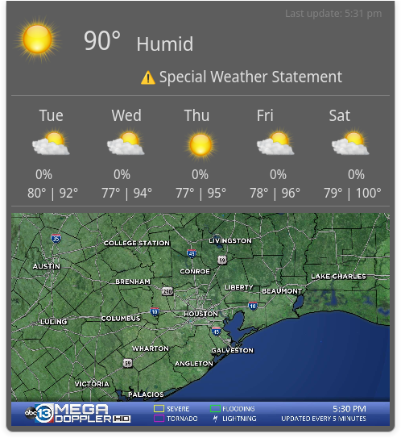
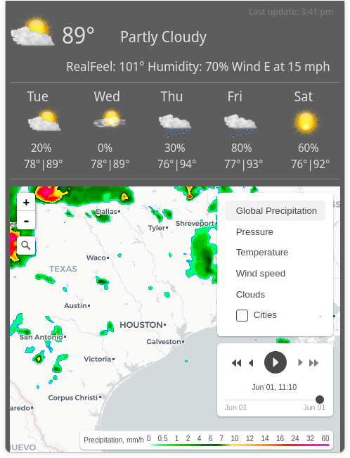
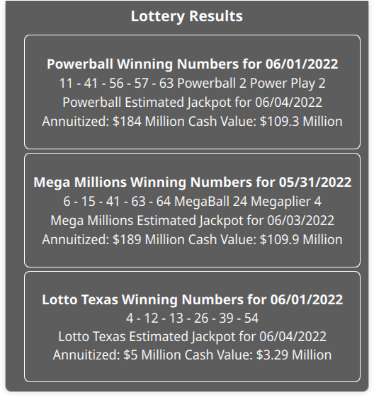
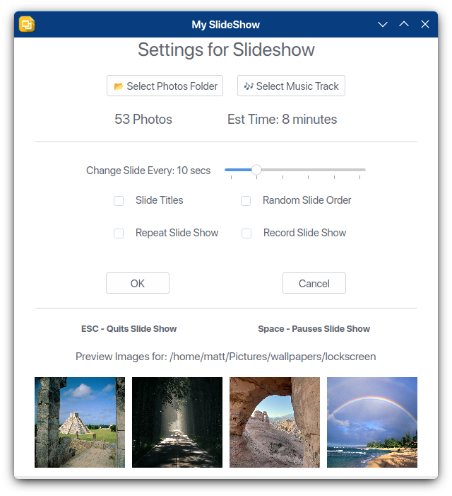

# Misc Plasma qml widgets/code
#### no config widget dev for personal use  
#### edit qml code to change weather lat/lon, sports team, stocks, etc.  

[G-Mail](https://github.com/txhammer68/qml/blob/master/G-Mail.zip)  
<picture>
  
</picture>  
[Dark Sky Weather](https://github.com/txhammer68/qml/blob/master/DarkSky.zip)  
<picture>
  
</picture>  
[Open Weather](https://github.com/txhammer68/qml/blob/master/OpenWeather.zip)  
<picture>
  
</picture>  
[Lotto](https://github.com/txhammer68/qml/blob/master/Lotto.zip)  
 <picture>
  
</picture>  
[Search](https://github.com/txhammer68/qml/blob/master/org.kde.search.zip)  
<picture>
  
</picture>  
[System Monitor Dashboard](https://github.com/txhammer68/qml/blob/master/SystemDashboard.zip)  
<picture>
  
</picture>  
[System Menu](https://github.com/txhammer68/qml/blob/master/system-menu.zip)  
<picture>
  
</picture>  
[G-Mail Workspace](https://github.com/txhammer68/qml/blob/master/gmail/gmail.zip)  
<picture>
  
</picture>  
[SlideShow w/ Ken Burn's Effects](https://github.com/txhammer68/qml/blob/master/slideshow.zip)  
<picture>
  
</picture>  
