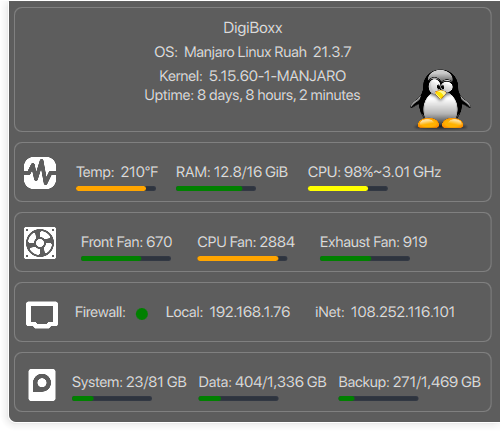

# Misc Plasma qml widgets/code

* G-Mail  
* Using python gmail oauth, yahoo finance, espn  

* Open Weather  

* Search  

* System Monitor Dashboard  
* 
* System Menu  

* 
* G-Mail Workspace  
* 
