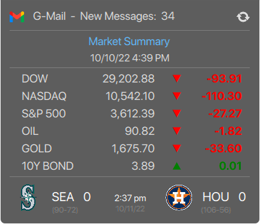

## Misc KDE 5 Plasma qml widgets
#### no config widgets developed for personal use  
#### edit qml code to change weather lat/lon, sports team, stocks, etc.  

[Lockscreen](lockscreen/readme.md)  

<picture>
  
</picture>  

<a href="lockscreen" onclick="window.open('https://raw.githubusercontent.com/txhammer68/qml/master/lockscreen-win10.png','targetWindow', 'toolbar=no, location=no, status=no, menubar=no, scrollbars=yes, resizable=yes, width=1280px, height=1024px, top=25px left=120px'); return false;">click here</a>

[G-Mail](https://raw.githubusercontent.com/txhammer68/qml/master/G-Mail.zip)  
<picture>
  
</picture>  
[Dark Sky Weather](https://raw.githubusercontent.com/txhammer68/qml/master/DarkSky.zip)  
<picture>
  
</picture>  
[Open Weather](https://raw.githubusercontent.com/txhammer68/qml/master/OpenWeather.zip)  
<picture>
  
</picture>  
[Lotto](https://raw.githubusercontent.com/txhammer68/qml/master/Lotto.zip)  
 <picture>
  
</picture>  
[Search](https://raw.githubusercontent.com/txhammer68/qml/master/org.kde.search.zip)  
<picture>
  
</picture>  
[System Monitor Dashboard](https://raw.githubusercontent.com/txhammer68/qml/master/SystemDashboard.zip)  
<picture>
  
</picture>  
[System Menu](https://raw.githubusercontent.com/txhammer68/qml/master/system-menu.zip)  
<picture>
  
</picture>  
Thanks to [kppleos](https://github.com/kppleos) for inspiration  
 
[G-Mail Workspace](https://raw.githubusercontent.com/txhammer68/qml/master/gmail/gmail.zip)  
<picture>
  
</picture>  
 
[SlideShow w/ Ken Burn's Effects](https://raw.githubusercontent.com/txhammer68/qml/master/slideshow.zip)  
<picture>
  
</picture>  
 
[Today Side Panel Widget](https://raw.githubusercontent.com/txhammer68/qml/master/Today.zip)  
<picture>
  
</picture>  
