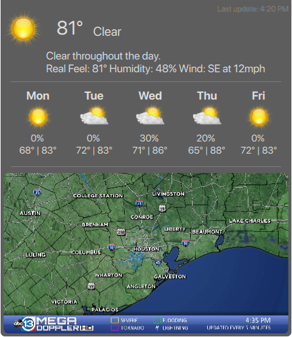

# Misc Plasma qml widgets/code
#### no config widget dev for personal use  
#### edit qml code to change weather lat/lon, sports team, stocks, etc.  

* [G-Mail](https://github.com/txhammer68/qml/blob/master/G-Mail.zip) 
 
* [Dark Sky Weather](https://github.com/txhammer68/qml/blob/master/DakrSky.zip) 
  
* [Open Weather](https://github.com/txhammer68/qml/blob/master/OpenWeather.zip) 
  
* [Lotto](https://github.com/txhammer68/qml/blob/master/Lotto.zip) 
  
* [Search](https://github.com/txhammer68/qml/blob/master/org.kde.search.zip) 

* [System Monitor Dashboard](https://github.com/txhammer68/qml/blob/master/SystemDashboard.zip) 
 
* [System Menu](https://github.com/txhammer68/qml/blob/master/system-menu.zip)  
 
* [G-Mail Workspace](https://github.com/txhammer68/qml/blob/master/gmail/gmail.zip) 
 
 * SlideShow w/ Ken Burn's Effects 
 
